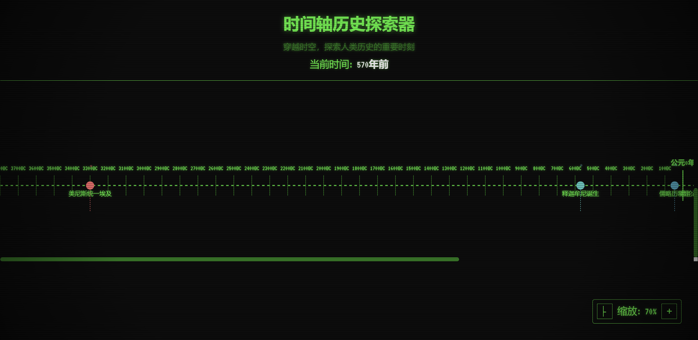
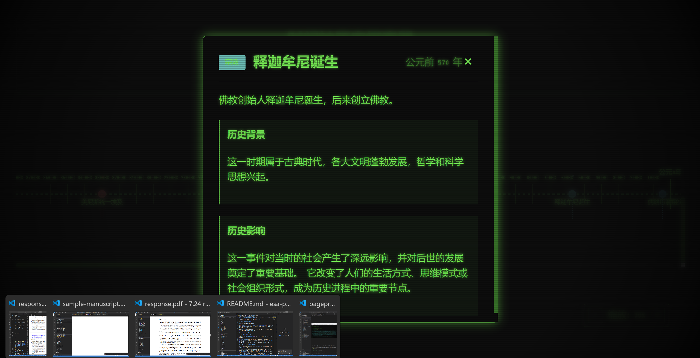

# 历史时间轴探索器 (Historical Timeline Explorer) 🕰️

基于复古终端项目启发的时间轴历史探索器，让用户以全新方式探索人类历史的重要时刻。



#阿里云ESA Pages #阿里云云工开物
本项目是**阿里云 ESA (Edge Security Acceleration) 边缘计算创新大赛**的创意参赛作品。
借助 **阿里云 ESA** 强大的边缘计算能力，我们将这个富交互的静态网站分发到全球节点，确保用户在世界任何角落都能体验到闪电般的加载速度。

## 项目特色 ✨

- **沉浸式时间旅行**：穿越从古代到未来的完整人类历史
- **3D时间轴可视化**：独特的SVG时间轴设计，每个历史事件都有独特标记
- **复古科技美学**：继承自原项目的CRT显示器效果和赛博朋克风格
- **交互式探索**：点击历史事件深入了解详细信息
- **动态缩放功能**：支持缩放查看不同时间密度的历史事件
- **时期分类**：按历史时期自动分类事件（古代、中世纪、文艺复兴等）

## 功能说明 🎯

1. **时间轴导航**：水平滚动查看不同历史时期
2. **事件交互**：点击历史事件标记查看详细信息
3. **缩放控制**：使用控制面板调整时间轴密度
4. **时期标记**：清晰显示历史时期的划分
5. **动态效果**：粒子动画增强视觉体验

## 技术栈 🛠️

- **前端框架**: React 19.2.0
- **3D渲染**: Three.js（准备扩展）
- **动画库**: Framer Motion
- **数据可视化**: D3.js
- **构建工具**: Vite 7.2.4
- **样式**: CSS Modules + SVG

## 快速开始 🚀

1. 安装依赖：
```bash
npm install
```

2. 启动开发服务器：
```bash
npm run dev
```

3. 构建生产版本：
```bash
npm run build
```

## 设计理念 🎨

该项目延续了原复古终端项目的美学理念，将传统的线性历史浏览转换为沉浸式的时间探索体验。用户不再被动阅读历史资料，而是主动在时间轴上"旅行"，发现历史事件之间的联系和影响。

## 未来扩展 🌟

- 3D场景模式：使用Three.js创建真正的3D时间隧道
- 地理信息：结合地图显示历史事件发生地点
- 多媒体支持：为历史事件添加图片、音频、视频
- 社交功能：用户可创建自己的历史时间轴
- VR支持：兼容VR设备进行沉浸式历史探索

## 创意灵感 💡

此项目灵感来源于复古终端项目的设计哲学——将传统的信息展示方式转化为互动性强、视觉冲击力强的体验。通过这种方式，我们可以让枯燥的历史知识变得更加生动有趣。

## ⚠️ 部署故障排除 (Troubleshooting)

如果你在部署时遇到错误：`code version number exceeds the quota limit`，这意味着你的阿里云 ESA 项目版本数量已达上限。

**解决方案:**
1. 登录 [阿里云 ESA 控制台](https://esa.console.aliyun.com/)。
2. 进入你的项目 -> **版本管理 (Versions)** (或边缘程序 Edge Routines)。
3. 删除旧的、不再使用的版本以释放配额。
4. 重新提交部署。

---

## 声明
“本项目由阿里云ESA提供加速、计算和保护”
